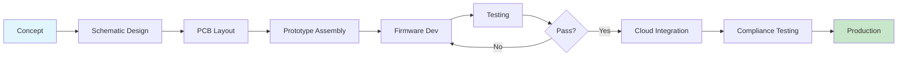
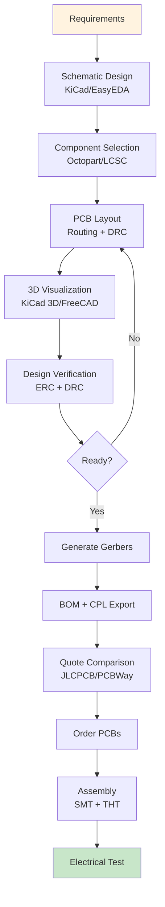
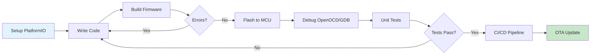
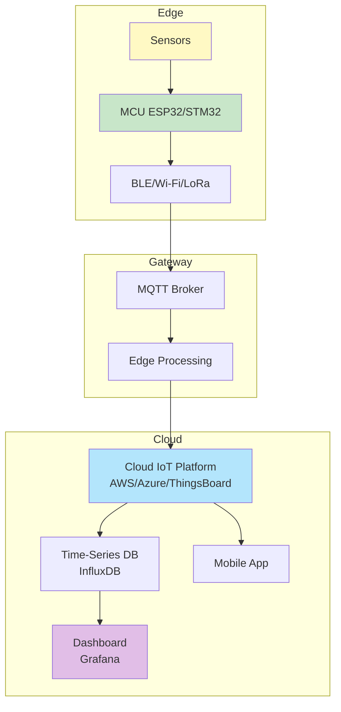
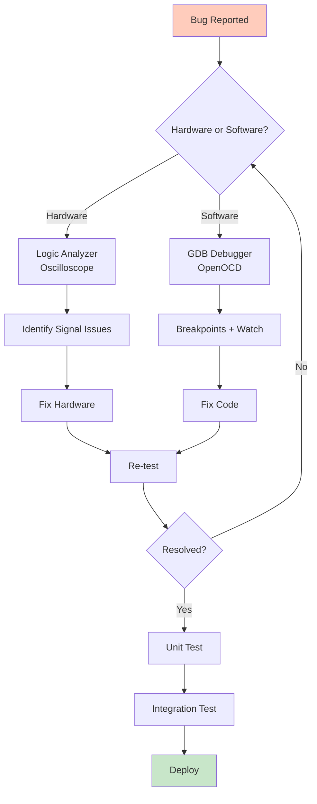
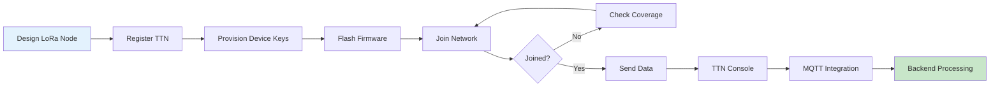

# 🚀 Free Resources for Embedded Development

> **A comprehensive, curated collection of 1,500+ free tools, resources, and references for Embedded Systems, IoT, and Hardware Engineers**  
> *From PCB Design to Production • MCU Firmware to Cloud • Hobbyist to Professional*

<div align="center">

[](CONTRIBUTING.md)
[](LICENSE)
[](https://awesome.re)
[](https://github.com/EurthTech)
[](http://makeapullrequest.com)

[](https://en.wikipedia.org/wiki/Embedded_C)
[](https://isocpp.org)
[](https://www.python.org)
[](docs/hardware-design.md)
[](docs/firmware.md)

</div>

---

## 📋 Quick Navigation

### 🎯 **Getting Started Paths**
- [🔰 Your First Embedded Project](#getting-started-first-project) - Arduino/ESP32 + Simulation
- [🏭 Professional Development Setup](#getting-started-professional) - Full toolchain for production
- [🏢 Industrial IoT System](#getting-started-industrial) - Modbus → MQTT → Cloud

### 📖 **Browse by Category**

#### 🔧 Hardware & Design
- [📐 A) Hardware Design](docs/hardware-design.md) - PCB, Simulation, CAD, BOM Tools
  - Schematic & PCB Tools (KiCad, EasyEDA, Flux) • Circuit Simulation • 3D CAD • Manufacturing

#### 💻 Firmware & Software
- [⚙️ B) Firmware & Embedded Software](docs/firmware.md) - MCUs, RTOS, Drivers, Debugging
  - ESP32, STM32, nRF • FreeRTOS, Zephyr • USB, Graphics, Storage • Bootloaders

#### 🌐 Connectivity & Protocols
- [📡 C) Connectivity & Networking](docs/connectivity.md) - Protocols, Wireless, Industrial Buses
  - UART, SPI, I2C, CAN • MQTT, CoAP, HTTP • LoRa, BLE, Wi-Fi • Modbus, OPC-UA

#### 🔍 Testing & Debug
- [🛠️ D) Debugging, Testing & Measurement](docs/debugging-testing.md) - Debug Probes, Logic Analyzers
  - OpenOCD, GDB • Logic Analyzers • Oscilloscopes • Protocol Sniffers

#### ☁️ Cloud & Backend
- [☁️ E) Cloud, Dashboards & DevOps](docs/cloud-devops.md) - IoT Platforms, Data Visualization
  - ThingsBoard, Node-RED • Grafana, InfluxDB • AWS/Azure IoT • Edge Computing

#### 📚 Documentation & Learning
- [📖 F) Documentation & Learning](docs/documentation-learning.md) - Free Courses, Books, References
  - Doxygen, Sphinx • Free Books • Online Courses • Academic Resources

#### ✅ Compliance & Safety
- [🛡️ G) Compliance & Certification](docs/compliance.md) - CE, FCC, RoHS, Safety Standards
  - EMC/EMI Testing • Safety Standards • RF Certification • Battery Compliance

#### 🤖 Advanced Topics
- [🚁 H) Advanced Topics](docs/advanced.md) - Automotive, Medical, Space, FPGA, Robotics
  - ISO 26262, IEC 60601 • Robotics, Drones • FPGA, ASIC • Satellite Systems

---

## 🎓 Getting Started Guides

### <a name="getting-started-first-project"></a>🔰 Your First Embedded Project

**Goal**: Blink an LED, read a sensor, connect to Wi-Fi

#### Recommended Stack
```
Hardware: ESP32 DevKit ($5) or Arduino Uno ($25)
Software: Arduino IDE or PlatformIO (both free)
Simulator: Wokwi (free online simulation)
Debug: Serial Monitor + Logic Analyzer
```

#### Step-by-Step
1. **Get Hardware** - [ESP32 boards](docs/firmware.md#esp32) or [Arduino boards](docs/hardware-design.md#arduino)
2. **Install Tools** - [PlatformIO](docs/firmware.md#platformio) or [Arduino IDE](docs/firmware.md#arduino-ide)
3. **Simulate First** - [Wokwi](docs/debugging-testing.md#wokwi) (test without hardware)
4. **Learn Basics** - [Free tutorials](docs/documentation-learning.md#tutorials)

**Total Cost**: $5-25 for hardware • 100% free software

---

### <a name="getting-started-professional"></a>🏭 Professional Development Setup

**Goal**: Production-ready firmware with debugging, testing, and version control

#### Professional Stack
```
MCU: STM32 / nRF52 / ESP32
IDE: VS Code + PlatformIO / STM32CubeIDE
RTOS: FreeRTOS / Zephyr
Debug: OpenOCD + GDB / Black Magic Probe
Version Control: Git + GitHub
CI/CD: GitHub Actions + Renode (simulation)
Testing: Unity, Ceedling, Renode
```

#### Essential Tools
- [STM32CubeIDE](docs/firmware.md#stm32cubeide) - Free professional IDE
- [Zephyr RTOS](docs/firmware.md#zephyr) - Modern, scalable RTOS
- [OpenOCD](docs/debugging-testing.md#openocd) - Free JTAG/SWD debugging
- [Black Magic Probe](docs/debugging-testing.md#black-magic-probe) - $70 open-hardware debugger

**Total Cost**: $20-100 for debug probe • All software free

---

### <a name="getting-started-industrial"></a>🏢 Industrial IoT System

**Goal**: Sensor → Gateway → Cloud → Dashboard

#### Industrial Stack
```
Sensors: Modbus RTU over RS-485
Edge Gateway: Raspberry Pi / Linux SBC
Protocol Bridge: Node-RED (Modbus → MQTT)
Cloud Platform: ThingsBoard (free tier)
Visualization: Grafana + InfluxDB
```

#### Complete Workflow
1. **Sensor Layer** - [Modbus devices](docs/connectivity.md#modbus)
2. **Edge Processing** - [Raspberry Pi](docs/hardware-design.md#raspberry-pi) + [Node-RED](docs/cloud-devops.md#node-red)
3. **IoT Platform** - [ThingsBoard](docs/cloud-devops.md#thingsboard) (device management + dashboards)
4. **Analytics** - [Grafana](docs/cloud-devops.md#grafana) + [InfluxDB](docs/cloud-devops.md#influxdb)

**Total Cost**: $50-100 for hardware • All software free

---

## 🏷️ Browse by Use Case

| **Use Case** | **Recommended Tools** | **Category** |
|-------------|---------------------|-------------|
| 🎨 PCB Design | KiCad, EasyEDA, Flux | [Hardware Design](docs/hardware-design.md) |
| 🔌 Circuit Simulation | LTspice, Qucs-S, Falstad | [Hardware Design](docs/hardware-design.md) |
| 💾 Firmware Dev (ESP32) | ESP-IDF, PlatformIO, Arduino | [Firmware](docs/firmware.md) |
| 💾 Firmware Dev (STM32) | STM32CubeIDE, libopencm3, Zephyr | [Firmware](docs/firmware.md) |
| 📶 Wi-Fi/BLE Dev | ESP32, nRF52, Zephyr, BLE Mesh | [Connectivity](docs/connectivity.md) |
| 🌐 MQTT Broker | Mosquitto, EMQX, HiveMQ | [Connectivity](docs/connectivity.md) |
| 🏭 Industrial Protocols | Modbus, OPC-UA, CANopen | [Connectivity](docs/connectivity.md) |
| 🐛 Debugging MCU | OpenOCD, Black Magic Probe, GDB | [Debugging](docs/debugging-testing.md) |
| 📊 Logic Analyzer | sigrok/PulseView, Saleae | [Debugging](docs/debugging-testing.md) |
| ☁️ IoT Cloud Platform | ThingsBoard, AWS IoT, Azure | [Cloud](docs/cloud-devops.md) |
| 📈 Data Visualization | Grafana, Node-RED, InfluxDB | [Cloud](docs/cloud-devops.md) |
| 🤖 Robotics | ROS2, MoveIt, Gazebo | [Advanced](docs/advanced.md) |
| ✈️ Drone Firmware | PX4, ArduPilot | [Advanced](docs/advanced.md) |
| 🎯 FPGA/ASIC | Yosys, nextpnr, Verilator | [Advanced](docs/advanced.md) |

---

## 🗂️ Complete Topic Index

### A) Hardware Design `[🔧 7 topics • 200+ tools]`
1. [Schematic & PCB Design Tools](docs/hardware-design.md#1-schematic--pcb-design-tools)
2. [Circuit Simulation & Analysis](docs/hardware-design.md#2-simulation--circuit-analysis)
3. [Mechanical / Enclosure / CAD Tools](docs/hardware-design.md#3-mechanical--enclosure--cad-tools)
4. [BOM, DFM, DFA & Manufacturing](docs/hardware-design.md#4-bom-dfm-dfa--manufacturing-tools)
5. [Electronics Calculators & References](docs/hardware-design.md#5-electronics-references--calculators)
6. [Component Search & Datasheets](docs/hardware-design.md#6-component-search--datasheets)
7. [Reference Designs & Open Hardware](docs/hardware-design.md#7-reference-designs--open-hardware)

### B) Firmware & Embedded Software `[⚙️ 6 topics • 300+ tools]`
8. [MCU SDKs & Toolchains](docs/firmware.md#8-mcu-sdks--toolchains)
9. [RTOS / Operating Systems](docs/firmware.md#9-rtos--operating-systems)
10. [Drivers, Stacks & Middleware](docs/firmware.md#10-drivers-stacks--middleware)
11. [Firmware Debugging & Reverse Engineering](docs/firmware.md#11-firmware-debugging--reverse-engineering)
12. [Bootloaders & OTA Update Systems](docs/firmware.md#12-bootloaders--ota-update-systems)
13. [Memory / Flash / Filesystem Utilities](docs/firmware.md#13-memory--flash--filesystem-utilities)

### C) Connectivity & Networking `[📡 4 topics • 250+ tools]`
14. [On-Device Communication Protocols](docs/connectivity.md#14-on-device-communication-protocols)
15. [Network & IoT Protocols](docs/connectivity.md#15-network--iot-protocols)
16. [LPWAN / LoRa / Cellular IoT](docs/connectivity.md#16-lpwan--lora--cellular-iot)
17. [Hardware Resources & Free Samples](docs/connectivity.md#17-hardware-design-resources-reference-designs--free-samples)

### D) Debugging, Testing & Measurement `[🛠️ Multiple sections]`
18. [Regulatory Certifications & Compliance](docs/compliance.md#regulatory-certifications)
19. [Secure Hardware & Cryptography](docs/firmware.md#security)
20. [TinyML Frameworks](docs/advanced.md#tinyml)
21. [Robotics & Motor Control](docs/advanced.md#robotics)

### E) Cloud, Dashboards & DevOps `[☁️ 6 topics]`
22. [Sensor & Vision Ecosystem](docs/advanced.md#sensors-vision)
23. [Data Management & Visualization](docs/cloud-devops.md#data-visualization)
24. [Test Equipment & RF Analyzers](docs/debugging-testing.md#test-equipment)
25. [Prototyping Ecosystems](docs/hardware-design.md#prototyping)
26. [IoT Backend & Device Management](docs/cloud-devops.md#iot-platforms)
27. [Industrial IoT & SCADA](docs/cloud-devops.md#industrial-iot)

### F) Documentation & Learning `[📖 Multiple sections]`
28. [Digital Twin & Simulation](docs/cloud-devops.md#digital-twin)
29. [Documentation & DevOps Tools](docs/documentation-learning.md#documentation-tools)
30. [Learning & Research Resources](docs/documentation-learning.md#learning-resources)

### G) Compliance & Certification `[✅ 4 topics]`
31. [EMI / EMC Pre-Compliance](docs/compliance.md#emi-emc)
32. [Safety Standards & Testing](docs/compliance.md#safety-standards)
33. [Battery & Environmental Cert](docs/compliance.md#battery-environmental)
34. [RF Certification & Spectrum](docs/compliance.md#rf-certification)

### H) Advanced Topics `[🚀 21+ topics]`
35-55. [Automotive, Medical, Space, FPGA, Robotics, AI & More](docs/advanced.md)

---

## 🌟 Featured Tools

### Most Popular (Community Favorites)

| Tool | Category | Use Case | Platform |
|------|----------|----------|----------|
| **[KiCad](docs/hardware-design.md#kicad)** | PCB Design | Professional EDA, no limits | 🪟🍎🐧 |
| **[ESP-IDF](docs/firmware.md#esp-idf)** | MCU SDK | ESP32 Wi-Fi/BLE | 🪟🍎🐧 |
| **[PlatformIO](docs/firmware.md#platformio)** | Build System | 1000+ MCU support | 🪟🍎🐧 |
| **[FreeRTOS](docs/firmware.md#freertos)** | RTOS | Industry standard | All MCUs |
| **[Zephyr](docs/firmware.md#zephyr)** | RTOS | Modern, scalable | All MCUs |
| **[ThingsBoard](docs/cloud-devops.md#thingsboard)** | IoT Platform | Device mgmt + dashboards | ☁️ |
| **[OpenOCD](docs/debugging-testing.md#openocd)** | Debugger | JTAG/SWD for all MCUs | 🪟🍎🐧 |
| **[sigrok/PulseView](docs/debugging-testing.md#sigrok)** | Logic Analyzer | 150+ protocol decoders | 🪟🍎🐧 |

🪟 = Windows • 🍎 = macOS • 🐧 = Linux • ☁️ = Cloud

---

## 🆚 Tool Comparison Tables

### RTOS Comparison
| RTOS | Footprint | Safety Cert | Best For | License |
|------|-----------|-------------|----------|---------|
| FreeRTOS | 10KB | ✅ SafeRTOS available | General MCU | MIT |
| Zephyr | 50KB+ | ⚠️ In progress | Modern IoT, security | Apache 2.0 |
| ChibiOS | 12KB | ❌ | STM32, low latency | GPL/commercial |
| RIOT | 15KB | ❌ | IoT, 6LoWPAN | LGPL |
| Azure RTOS | 8KB | ✅ Certified | STM32, NXP, Renesas | MIT |

### PCB Design Tools
| Tool | Platform | Layers | Price Model | Cloud |
|------|----------|--------|-------------|-------|
| KiCad | Desktop | Unlimited | 100% Free | ❌ |
| EasyEDA | Browser | Unlimited | Free + paid | ✅ |
| Flux | Browser | Limited free | Freemium | ✅ |
| LibrePCB | Desktop | Unlimited | 100% Free | ❌ |

### IoT Cloud Platforms
| Platform | Device Limit | Dashboards | OTA | Price |
|----------|-------------|------------|-----|-------|
| ThingsBoard | Unlimited | ✅ | ✅ | Free tier |
| AWS IoT Core | Pay-per-msg | ✅ | ✅ | Free tier 12mo |
| Azure IoT Hub | 8000 msg/day | ✅ | ✅ | Free tier |
| Blynk | 5 devices | ✅ | ✅ | Free tier |

More detailed comparisons in each category page.

---

## 📊 Development Workflows

### 🔄 Complete Product Development Cycle



### 🛠️ PCB Design to Manufacturing



### 💻 Firmware Development Workflow



### 🌐 IoT System Architecture



### 🔍 Debug & Test Workflow



### 📡 LoRaWAN Deployment Flow



---

## 🤝 How to Contribute

We welcome contributions! Please see [CONTRIBUTING.md](CONTRIBUTING.md) for guidelines.

### Contribution Guidelines
- ✅ **Only free or open-source tools** (free tiers acceptable)
- ✅ Add under the correct category with description + link
- ✅ Include platform tags: `[Win/Mac/Linux]` `[Beginner/Pro]` `[Production-Ready]`
- ❌ No affiliate links or paid promotional content
- ❌ No duplicate entries

### Adding a New Tool
```markdown
- **Tool Name** `[Platform: Win/Mac/Linux]` `[Level: Beginner]` `[Status: 🟢Production]` — https://tool.com  
  Brief description (1-2 lines) highlighting key features and use cases.
```

**Status Indicators**:
- 🟢 **Production-Ready** - Stable, widely used
- 🟡 **Beta/Active Development** - Works but evolving
- 🔴 **Experimental** - Research/proof-of-concept

---

## 📊 Repository Statistics

- **Total Tools**: 1,500+
- **Categories**: 55 organized topics
- **Lines of Documentation**: 7,000+
- **Coverage**: Hardware → Firmware → Cloud → Production
- **Updated**: January 2026

---

## 📜 License

This curated list is dedicated to the public domain under [CC0 1.0 Universal](LICENSE).

Individual tools listed here maintain their own licenses (open-source, proprietary free tier, etc.).

---

## 🙏 Acknowledgments

Curated with ❤️ by **Eurth Tech** for the global embedded systems community.

Special thanks to all open-source maintainers, hardware communities, and engineers who make these resources freely available.

---

<p align="center">
  <sub>Built with passion for embedded systems • Star ⭐ if this helps you!</sub>
</p>  


